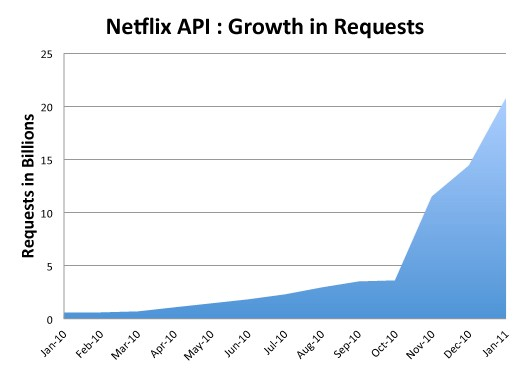
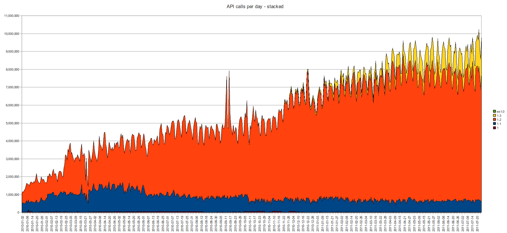

##

<h1>Basics</h1>

## But, why?

## Why? (contd.)

Thoughts going into this:

- save on bandwidth
- save on cpu usage

These are just my initial thoughts

We will try and find out whether they are valid.

## Does Gzip solve all these problems?

Not quite.

Gzip from the client to server is not recommended.
[https://stackoverflow.com/a/48572297](https://stackoverflow.com/a/48572297)

Gzip levels the playing field from the server to client.

However:

  - Some formats could still save data even after gzip
  - Browsers do not gzip data sent to the server by default
    - most places like AWS or even DigitalOcean do not charge for inbound traffic.

## Examples of Scale

  
  [Link](https://medium.com/netflix-techblog/redesigning-the-netflix-api-db5a7221fcff)

  
  [Link](https://blog.mailchimp.com/10m-api-calls-per-day-more/)

Reducing bandwith costs only makes sense at scale

EG...

As of 2011:

- Netflix received 20 billion http requests
  - using terrible math, we can estimate that an average response is 5kb
  - and from there they are paying 8k per month just for outbound data

---
