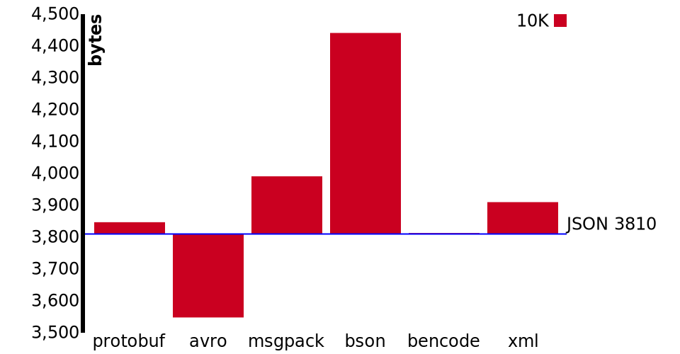
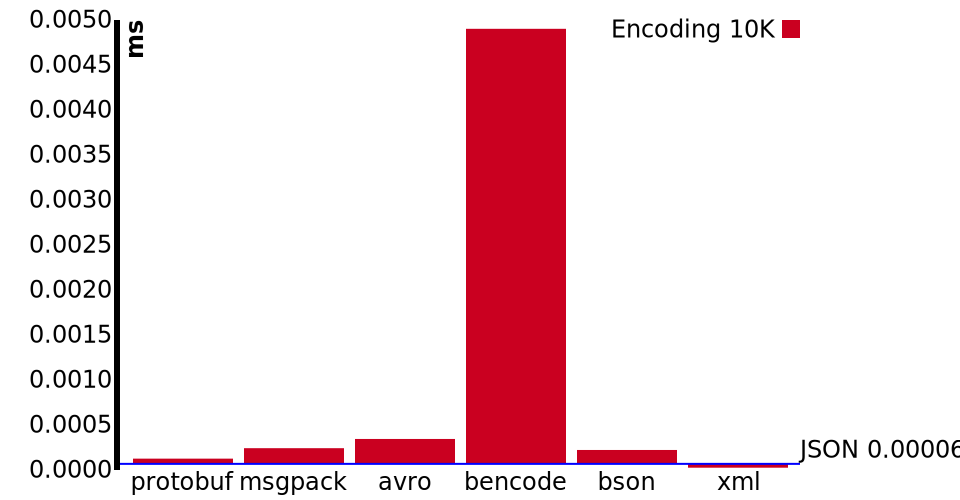
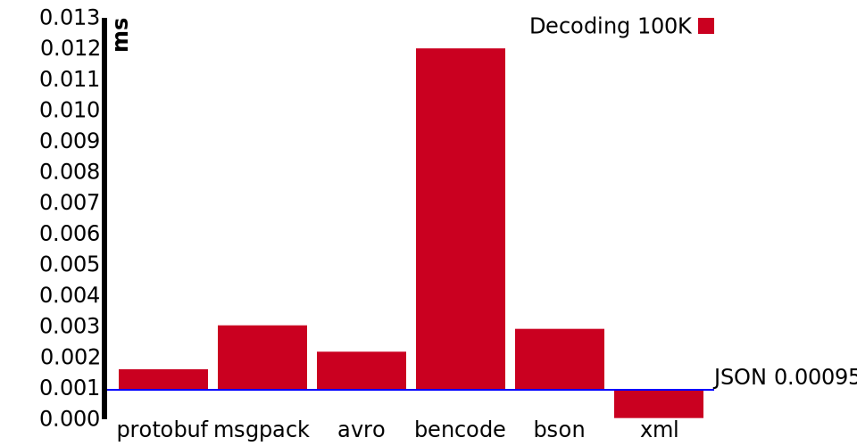
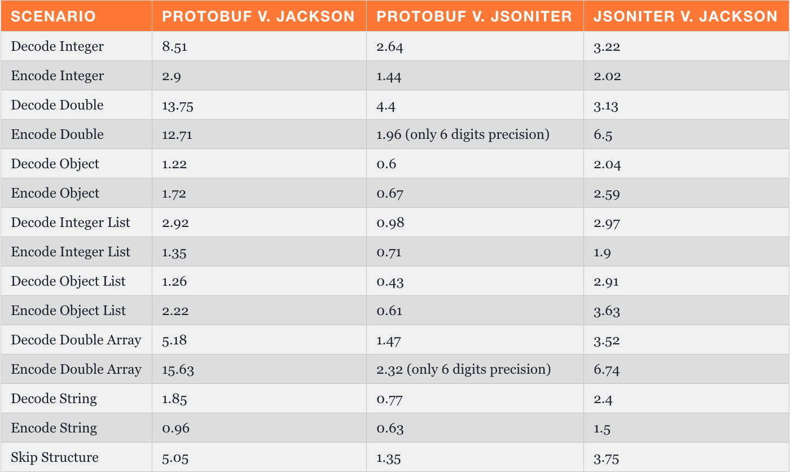

<!--

Synopsis: There are alternatives to JSON for sending data from client to server or between servers. What do they do and what do they look like? What are their benefits?Payload size? Encoding or Decoding speed? Let's find out. JSON is probably sufficient for most cases, but let's try and find the edge cases where you might want improvement.

-->

##

<h1>Testing Methodology</h1>

## Different Object Sizes

- medium (~10kb)
- large (~100kb)

## Metrics

## Content-Length (Uncompressed)

  

  

## Content-Length (Gzipped)

  

  

## Library overhead

  

  

##

<h1>Browser Runtimes</h1>

Chrome only so far

Take these with a grain of salt.

## Browser: Encoding 10K

## Browser: Encoding 100K

## Browser: Decoding 10K

## Browser: Decoding 100K

##

<h1>Node CPU Runtime</h1>

Its important to note that Node optimizes for JSON.

Other platforms might see results that favor JSON much less.

## Node: Encoding 10K

## Node: Encoding 100K

## Node: Decoding 10K

## Node: Decoding 100K

##

<h1>Other Languages</h1>

## Go

[https://github.com/alecthomas/go_serialization_benchmarks](https://github.com/alecthomas/go_serialization_benchmarks)

## Java

[https://dzone.com/articles/is-protobuf-5x-faster-than-json](https://dzone.com/articles/is-protobuf-5x-faster-than-json)

- 2-part series
- shows Java has some JSON libraries that are faster than protobuf for general data

---
